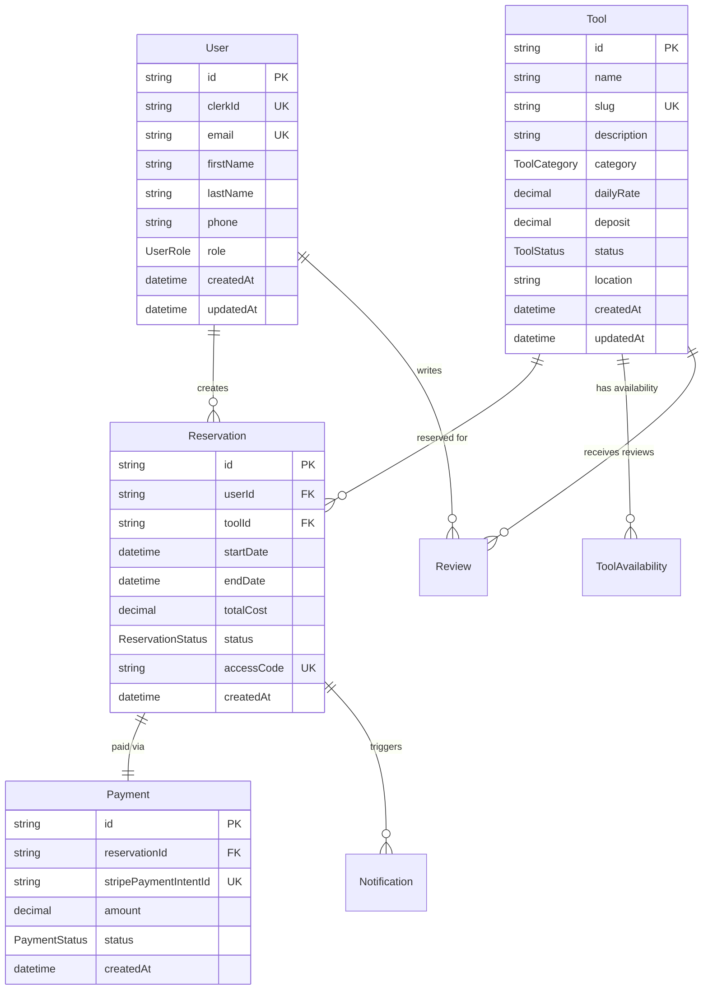

# Design Document

## Overview

The Self-Service Tool Rental MVP is a Progressive Web Application built with Next.js 14 App Router, designed to provide a seamless mobile-first experience for tool rentals. The system architecture follows an API-first approach with clean separation between frontend and backend concerns, enabling future native mobile applications without backend rewrites.

The application serves Utah County residents through a PWA that supports offline browsing, secure online payments via Stripe, time-bound access code generation through cloud locker APIs, and comprehensive reservation management. The system is designed for scalability with a single-tenant business model initially.

## Architecture

### System Boundaries

```mermaid
graph TB
    subgraph "Client Layer"
        PWA[Next.js 14 PWA]
        SW[Service Worker]
        Cache[Browser Cache]
    end

    subgraph "API Layer"
        API[Next.js API Routes]
        Auth[Clerk Authentication]
        Webhooks[Webhook Handlers]
    end

    subgraph "Data Layer"
        DB[(PostgreSQL + Prisma)]
        Files[File Storage]
    end

    subgraph "External Services"
        Clerk[Clerk Auth Service]
        Stripe[Stripe Payments]
        Lock1er[Cloud Locker API]
        SMS[SMS Provider]
        Email[Email Provider]
    end

    PWA --> API
    SW --> Cache
    API --> Auth
    API --> DB
    API --> Webhooks
    Webhooks --> Clerk
    Webhooks --> Stripe
    API --> Locker
    API --> SMS
    API --> Email
```1

### Technology Stack

**Frontend:**
- Next.js 14 with App Router for server-side rendering and routing
- React 18 with TypeScript for type-safe component development
- Tailwind CSS with shadcn/ui for consistent design system
- @ducanh2912/next-pwa for Progressive Web App capabilities
- React Hook Form with Zod for form validation
- TanStack Query for state management and caching

**Backend:**
- Next.js API routes for serverless backend functionality
- Prisma ORM with PostgreSQL for data persistence
- Clerk for authentication and user management
- Stripe for payment processing and subscription management

**Infrastructure:**
- Vercel for hosting and deployment
- PostgreSQL database (Vercel Postgres or external)
- Cloud storage for images and documents

### Security Architecture

**Authentication Flow:**
```mermaid
sequenceDiagram
    participant User
    participant PWA
    participant Clerk
    participant API
    participant DB

    User->>PWA: Access protected route
    PWA->>Clerk: Check session
    alt Session valid
        Clerk->>PWA: Return JWT token
        PWA->>API: Request with JWT
        API->>Clerk: Verify token
        Clerk->>API: Token valid + user data
        API->>DB: Execute authorized operation
        DB->>API: Return data
        API->>PWA: Return response
    else Session invalid
        PWA->>Clerk: Redirect to sign-in
        Clerk->>User: Show auth interface
        User->>Clerk: Authenticate
        Clerk->>PWA: Redirect with session
    end
```

**Security Measures:**
- HTTPS-only with HSTS headers
- Content Security Policy with strict-dynamic for third-party integrations
- JWT token verification for all protected API routes
- Webhook signature verification for Clerk and Stripe
- Input validation using Zod schemas
- SQL injection prevention through Prisma ORM
- Secrets encryption at rest with regular key rotation

## Components and Interfaces

### Core Components

#### Tool Management System
```typescript
interface Tool {
  id: string;
  name: string;
  description: string;
  category: ToolCategory;
  brand?: string;
  model?: string;
  dailyRate: number;
  weeklyRate?: number;
  monthlyRate?: number;
  deposit: number;
  status: ToolStatus;
  condition: string;
  location: string;
  images: string[];
  specifications: Record<string, any>;
  replacementCost: number;
  trainingRequired: boolean;
  policies: string[];
  createdAt: Date;
  updatedAt: Date;
}

enum ToolStatus {
  AVAILABLE = 'AVAILABLE',
  RENTED = 'RENTED',
  MAINTENANCE = 'MAINTENANCE',
  RETIRED = 'RETIRED'
}

enum ToolCategory {
  PRESSURE_WASHERS = 'PRESSURE_WASHERS',
  CARPET_CLEANERS = 'CARPET_CLEANERS',
  LAWN_GARDEN = 'LAWN_GARDEN',
  POWER_TOOLS = 'POWER_TOOLS'
}
```

#### Reservation System
```typescript
interface Reservation {
  id: string;
  userId: string;
  toolId: string;
  startDate: Date;
  endDate: Date;
  totalCost: number;
  baseRate: number;
  taxes: number;
  fees: number;
  deposit: number;
  weekendMultiplier?: number;
  status: ReservationStatus;
  accessCode?: string;
  accessCodeValidFrom?: Date;
  accessCodeValidTo?: Date;
  notes?: string;
  createdAt: Date;
  updatedAt: Date;
}

enum ReservationStatus {
  PENDING = 'PENDING',
  CONFIRMED = 'CONFIRMED',
  ACTIVE = 'ACTIVE',
  COMPLETED = 'COMPLETED',
  CANCELLED = 'CANCELLED',
  OVERDUE = 'OVERDUE'
}
```

#### Cloud Locker Provider Interface
```typescript
interface LockerProvider {
  createCode(params: CreateCodeParams): Promise<CreateCodeResponse>;
  deleteCode(reservationId: string): Promise<DeleteCodeResponse>;
  getStatus(reservationId?: string): Promise<LockerStatus>;
}

interface CreateCodeParams {
  reservationId: string;
  code?: string;
  validFrom: Date;
  validTo: Date;
  doorId?: string;
  metadata?: Record<string, any>;
}

interface CreateCodeResponse {
  code: string;
  externalId: string;
  success: boolean;
  error?: string;
}

interface LockerStatus {
  state: 'ONLINE' | 'OFFLINE' | 'MAINTENANCE';
  lastEventAt: Date;
  activeReservations: number;
}
```

#### Payment Processing
```typescript
interface PaymentIntent {
  id: string;
  reservationId: string;
  amount: number;
  currency: string;
  status: PaymentStatus;
  stripePaymentIntentId?: string;
  paymentMethod?: string;
  metadata: Record<string, any>;
  createdAt: Date;
  updatedAt: Date;
}

enum PaymentStatus {
  PENDING = 'PENDING',
  PROCESSING = 'PROCESSING',
  SUCCEEDED = 'SUCCEEDED',
  FAILED = 'FAILED',
  CANCELLED = 'CANCELLED',
  REFUNDED = 'REFUNDED'
}
```

### API Interface Design

#### REST API Endpoints

**Tool Management:**
```typescript
GET /api/v1/tools
  Query: ?category=string&minPrice=number&maxPrice=number&available=date&search=string&cursor=string&limit=number
  Response: PaginatedResponse<Tool[]>

GET /api/v1/tools/[id]
  Response: Tool & { availability: AvailabilityCalendar }

POST /api/v1/tools (Admin only)
  Body: CreateToolRequest
  Response: Tool
```

**Reservation Management:**
```typescript
POST /api/v1/reservations/quote
  Body: { toolId: string, startDate: string, endDate: string }
  Response: ReservationQuote

POST /api/v1/reservations
  Body: CreateReservationRequest
  Headers: { 'Idempotency-Key': string }
  Response: Reservation

GET /api/v1/reservations/[id]
  Response: Reservation & { tool: Tool, payment: PaymentIntent }
```

**Administrative Endpoints:**
```typescript
POST /api/v1/locker-codes (Admin only)
  Body: { reservationId: string, regenerate?: boolean }
  Response: { code: string, validFrom: string, validTo: string }

DELETE /api/v1/locker-codes/[reservationId] (Admin only)
  Response: { success: boolean }

GET /api/v1/analytics/* (Admin only)
  Response: AnalyticsData
```

### PWA Service Worker Strategy

```typescript
// Service Worker Caching Configuration
const cacheStrategies = {
  // Static assets - cache first
  static: {
    pattern: /\.(js|css|png|jpg|jpeg|svg|gif|webp|woff2|ico)$/,
    strategy: 'CacheFirst',
    cacheName: 'static-assets',
    expiration: { maxEntries: 100, maxAgeSeconds: 30 * 24 * 60 * 60 }
  },

  // Tool catalog - stale while revalidate
  tools: {
    pattern: /\/api\/v1\/tools/,
    strategy: 'StaleWhileRevalidate',
    cacheName: 'tools-api',
    expiration: { maxEntries: 50, maxAgeSeconds: 60 * 60 }
  },

  // User-specific data - network first
  account: {
    pattern: /\/api\/v1\/(reservations|user)/,
    strategy: 'NetworkFirst',
    cacheName: 'user-data',
    networkTimeoutSeconds: 3,
    expiration: { maxAgeSeconds: 30 * 60 }
  },

  // Payment operations - network only
  payments: {
    pattern: /\/api\/v1\/(payments|checkout)/,
    strategy: 'NetworkOnly'
  }
};

// Background sync for reservation attempts
const backgroundSync = {
  queueName: 'reservationAttempts',
  broadcastChannel: 'sw-messages',
  maxRetentionTime: 24 * 60 * 60 * 1000 // 24 hours
};
```

## Data Models

### Database Schema (Prisma)

```prisma
model User {
  id          String   @id @default(cuid())
  clerkId     String   @unique
  email       String   @unique
  firstName   String?
  lastName    String?
  phone       String?
  role        UserRole @default(CUSTOMER)
  createdAt   DateTime @default(now())
  updatedAt   DateTime @updatedAt

  reservations Reservation[]
  reviews      Review[]

  @@map("users")
}

model Tool {
  id              String       @id @default(cuid())
  name            String
  slug            String       @unique
  description     String
  category        ToolCategory
  brand           String?
  model           String?
  dailyRate       Decimal      @db.Decimal(10, 2)
  weeklyRate      Decimal?     @db.Decimal(10, 2)
  monthlyRate     Decimal?     @db.Decimal(10, 2)
  deposit         Decimal      @db.Decimal(10, 2)
  status          ToolStatus   @default(AVAILABLE)
  condition       String
  location        String
  images          String[]
  specifications  Json?
  replacementCost Decimal      @db.Decimal(10, 2)
  trainingRequired Boolean     @default(false)
  policies        String[]
  createdAt       DateTime     @default(now())
  updatedAt       DateTime     @updatedAt

  reservations    Reservation[]
  reviews         Review[]
  availability    ToolAvailability[]

  @@map("tools")
}

model Reservation {
  id                  String            @id @default(cuid())
  userId              String
  toolId              String
  startDate           DateTime
  endDate             DateTime
  totalCost           Decimal           @db.Decimal(10, 2)
  baseRate            Decimal           @db.Decimal(10, 2)
  taxes               Decimal           @db.Decimal(10, 2)
  fees                Decimal           @db.Decimal(10, 2)
  deposit             Decimal           @db.Decimal(10, 2)
  weekendMultiplier   Decimal?          @db.Decimal(4, 2)
  status              ReservationStatus @default(PENDING)
  accessCode          String?           @unique
  accessCodeValidFrom DateTime?
  accessCodeValidTo   DateTime?
  lockerExternalId    String?
  providerSyncPending Boolean           @default(false)
  notes               String?
  createdAt           DateTime          @default(now())
  updatedAt           DateTime          @updatedAt

  user                User              @relation(fields: [userId], references: [id])
  tool                Tool              @relation(fields: [toolId], references: [id])
  payment             Payment?
  notifications       Notification[]

  @@map("reservations")
}

model Payment {
  id                    String        @id @default(cuid())
  reservationId         String        @unique
  stripePaymentIntentId String?       @unique
  amount                Decimal       @db.Decimal(10, 2)
  currency              String        @default("usd")
  status                PaymentStatus @default(PENDING)
  paymentMethod         String?
  refundAmount          Decimal?      @db.Decimal(10, 2)
  metadata              Json?
  createdAt             DateTime      @default(now())
  updatedAt             DateTime      @updatedAt

  reservation           Reservation   @relation(fields: [reservationId], references: [id])

  @@map("payments")
}

model ToolAvailability {
  id        String   @id @default(cuid())
  toolId    String
  date      DateTime @db.Date
  available Boolean  @default(true)
  reason    String?
  createdAt DateTime @default(now())

  tool      Tool     @relation(fields: [toolId], references: [id])

  @@unique([toolId, date])
  @@map("tool_availability")
}

model Notification {
  id            String           @id @default(cuid())
  reservationId String
  type          NotificationType
  channel       String // 'SMS', 'EMAIL'
  recipient     String
  content       String
  status        String           @default("PENDING")
  sentAt        DateTime?
  createdAt     DateTime         @default(now())

  reservation   Reservation      @relation(fields: [reservationId], references: [id])

  @@map("notifications")
}

enum UserRole {
  CUSTOMER
  ADMIN
}

enum ToolCategory {
  PRESSURE_WASHERS
  CARPET_CLEANERS
  LAWN_GARDEN
  POWER_TOOLS
}

enum ToolStatus {
  AVAILABLE
  RENTED
  MAINTENANCE
  RETIRED
}

enum ReservationStatus {
  PENDING
  CONFIRMED
  ACTIVE
  COMPLETED
  CANCELLED
  OVERDUE
}

enum PaymentStatus {
  PENDING
  PROCESSING
  SUCCEEDED
  FAILED
  CANCELLED
  REFUNDED
}

enum NotificationType {
  CONFIRMATION
  PICKUP_REMINDER
  RETURN_REMINDER
  OVERDUE_NOTICE
  CANCELLATION
}
```

### Data Relationships



## Error Handling

### Error Classification

**Client Errors (4xx):**
- 400 Bad Request: Invalid input data, validation failures
- 401 Unauthorized: Missing or invalid authentication
- 403 Forbidden: Insufficient permissions
- 404 Not Found: Resource does not exist
- 409 Conflict: Tool availability conflicts, duplicate reservations
- 422 Unprocessable Entity: Business logic violations
- 429 Too Many Requests: Rate limiting exceeded

**Server Errors (5xx):**
- 500 Internal Server Error: Unexpected server errors
- 502 Bad Gateway: External service failures (Stripe, Locker API)
- 503 Service Unavailable: Database connection issues, maintenance mode
- 504 Gateway Timeout: External service timeouts

### Error Response Format

```typescript
interface APIError {
  error: string;
  message: string;
  code?: string;
  details?: Record<string, any>;
  requestId: string;
  timestamp: string;
}

// Example error responses
{
  "error": "VALIDATION_ERROR",
  "message": "Invalid reservation dates",
  "code": "INVALID_DATE_RANGE",
  "details": {
    "startDate": "Must be in the future",
    "endDate": "Must be after start date"
  },
  "requestId": "req_abc123",
  "timestamp": "2024-01-15T10:30:00Z"
}
```

### Fallback Mechanisms

**Locker Provider Failures:**
```typescript
class LockerProviderService {
  async createCode(params: CreateCodeParams): Promise<CreateCodeResponse> {
    try {
      return await this.cloudProvider.createCode(params);
    } catch (error) {
      // Fallback to local code generation
      const localCode = this.generateLocalCode();

      // Store with sync pending flag
      await this.storePendingSync(params.reservationId, localCode, params);

      // Notify administrators
      await this.notifyAdminOfProviderFailure(error);

      return {
        code: localCode,
        externalId: `local_${Date.now()}`,
        success: true,
        fallback: true
      };
    }
  }
}
```

**Offline Payment Handling:**
```typescript
class PaymentService {
  async processPayment(paymentIntent: PaymentIntent): Promise<PaymentResult> {
    if (!navigator.onLine) {
      // Queue for background sync
      await this.queuePaymentForSync(paymentIntent);

      return {
        status: 'queued',
        message: 'Payment will be processed when connection is restored',
        queueId: `payment_${Date.now()}`
      };
    }

    try {
      return await this.stripeService.processPayment(paymentIntent);
    } catch (error) {
      if (error.type === 'network_error') {
        await this.queuePaymentForSync(paymentIntent);
        return { status: 'queued', error: error.message };
      }
      throw error;
    }
  }
}
```

## Testing Strategy

### Testing Pyramid

**Unit Tests (70%):**
- Business logic functions
- Utility functions and helpers
- React component logic
- API route handlers
- Database operations with Prisma

**Integration Tests (20%):**
- API endpoint testing with real database
- Authentication flows with Clerk
- Payment processing with Stripe test mode
- Locker provider integration with mock APIs
- PWA functionality and service worker behavior

**End-to-End Tests (10%):**
- Complete user journeys from browsing to rental completion
- PWA installation and offline functionality
- Cross-browser compatibility testing
- Mobile device testing on real devices

### Test Implementation

**API Testing with Vitest:**
```typescript
// tests/api/reservations.test.ts
describe('/api/v1/reservations', () => {
  beforeEach(async () => {
    await setupTestDatabase();
    await seedTestData();
  });

  it('should create reservation with valid data', async () => {
    const reservationData = {
      toolId: 'tool_123',
      startDate: '2024-02-01',
      endDate: '2024-02-02',
      userId: 'user_123'
    };

    const response = await request(app)
      .post('/api/v1/reservations')
      .set('Authorization', `Bearer ${testJWT}`)
      .send(reservationData)
      .expect(201);

    expect(response.body).toMatchObject({
      id: expect.any(String),
      status: 'PENDING',
      totalCost: expect.any(Number)
    });
  });

  it('should prevent double booking', async () => {
    // Create first reservation
    await createTestReservation('tool_123', '2024-02-01', '2024-02-02');

    // Attempt overlapping reservation
    const response = await request(app)
      .post('/api/v1/reservations')
      .set('Authorization', `Bearer ${testJWT}`)
      .send({
        toolId: 'tool_123',
        startDate: '2024-02-01',
        endDate: '2024-02-02'
      })
      .expect(409);

    expect(response.body.error).toBe('AVAILABILITY_CONFLICT');
  });
});
```

**Component Testing with React Testing Library:**
```typescript
// tests/components/ToolCard.test.tsx
describe('ToolCard', () => {
  const mockTool = {
    id: 'tool_123',
    name: 'Pressure Washer 2000 PSI',
    dailyRate: 29.99,
    status: 'AVAILABLE',
    images: ['/tool1.jpg'],
    category: 'PRESSURE_WASHERS'
  };

  it('should display tool information correctly', () => {
    render(<ToolCard tool={mockTool} />);

    expect(screen.getByText('Pressure Washer 2000 PSI')).toBeInTheDocument();
    expect(screen.getByText('$29.99/day')).toBeInTheDocument();
    expect(screen.getByText('Available')).toBeInTheDocument();
  });

  it('should handle offline state gracefully', () => {
    // Mock offline state
    Object.defineProperty(navigator, 'onLine', {
      writable: true,
      value: false
    });

    render(<ToolCard tool={mockTool} />);

    expect(screen.getByText('Offline - View Only')).toBeInTheDocument();
    expect(screen.getByRole('button', { name: /reserve/i })).toBeDisabled();
  });
});
```

**PWA Testing:**
```typescript
// tests/pwa/service-worker.test.ts
describe('Service Worker', () => {
  it('should cache static assets', async () => {
    const mockCache = new Map();
    global.caches = {
      open: jest.fn().mockResolvedValue({
        match: jest.fn().mockImplementation(req => mockCache.get(req.url)),
        put: jest.fn().mockImplementation((req, res) => mockCache.set(req.url, res))
      })
    } as any;

    const sw = new ServiceWorker();
    await sw.handleFetch(new Request('/images/tool1.jpg'));

    expect(mockCache.has('/images/tool1.jpg')).toBe(true);
  });

  it('should queue failed reservation requests', async () => {
    const mockQueue = [];
    global.navigator = { onLine: false } as any;

    const sw = new ServiceWorker();
    const request = new Request('/api/v1/reservations', {
      method: 'POST',
      body: JSON.stringify({ toolId: 'tool_123' })
    });

    await sw.handleFetch(request);

    expect(mockQueue).toHaveLength(1);
    expect(mockQueue[0]).toMatchObject({
      url: '/api/v1/reservations',
      method: 'POST'
    });
  });
});
```

### Performance Testing

**Lighthouse CI Integration:**
```javascript
// .lighthouserc.js
module.exports = {
  ci: {
    collect: {
      url: ['http://localhost:3000', 'http://localhost:3000/tools'],
      startServerCommand: 'npm run build && npm run start',
    },
    assert: {
      assertions: {
        'categories:performance': ['warn', { minScore: 0.9 }],
        'categories:accessibility': ['error', { minScore: 0.9 }],
        'categories:best-practices': ['warn', { minScore: 0.9 }],
        'categories:seo': ['warn', { minScore: 0.9 }],
        'categories:pwa': ['error', { minScore: 0.9 }],
      },
    },
    upload: {
      target: 'temporary-public-storage',
    },
  },
};
```

This comprehensive design document provides the technical foundation for implementing the Self-Service Tool Rental MVP with proper architecture, security, error handling, and testing strategies aligned with the approved requirements.